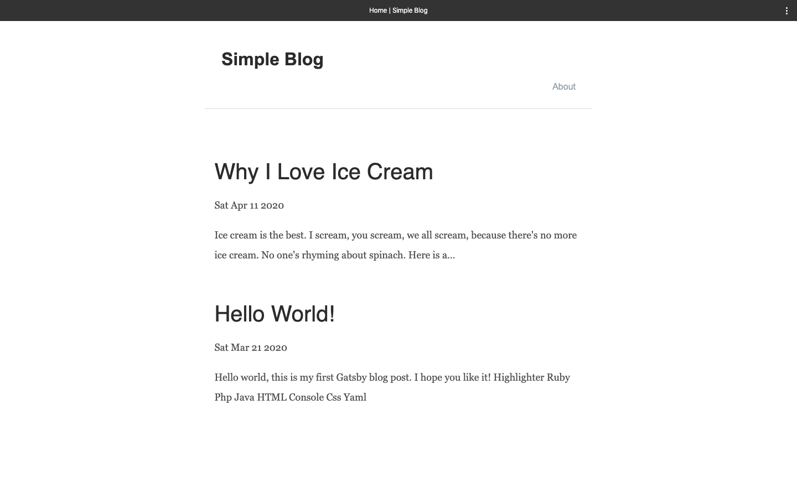

<h1 align="center">Gatsby Simple Blog Starter</h1>
<p>
  
  <a href="https://github.com/thecodemint/gatsby-starter-simple/tree/master#readme" target="_blank">
    
  </a>
  <a href="https://github.com/gatsbyjs/gatsby-starter-default/graphs/commit-activity" target="_blank">
    
  </a>
  <a href="https://github.com/thecodemint/gatsby-starter-simple/blob/master/LICENSE" target="_blank">
    
  </a>
</p>



> A minimal blogging starter
>* styled-components
>* gatsby-plugin-google-analytics
>* gatsby-plugin-disqus
>* gatsby-transformer-remark
>* gatsby-plugin-offline

### ✨ [Demo](https://thecodemint.github.io/gatsby-starter-simple/)

## Use as Gatsby starter
```sh
gatsby new project-name https://github.com/thecodemint/gatsby-starter-simple.git 
```

## Config
> To make this blog your own, simply change the configs in gatsby-config.js
> To add your own posts, write markdown files similar to the example templates in src/posts and save them in the same directory. Simply commit your changes and push to publish your posts
> Plese note that the defaut disqus shortname is just a Chinese example, use your own by visiting Disqus to view the comment section in English

## Author

👤 **Collins Muriuki**

* Website: https://muriuki.dev
* Github: [@collinsmuriuki](https://github.com/collinsmuriuki)

## 🤝 Contributing

Contributions, issues and feature requests are welcome!<br />Feel free to check [issues page](https://github.com/thecodemint/gatsby-starter-simple/issues). 

## Show your support

Give a ⭐️ if this project helped you!

## 📝 License

Copyright © 2020 [Collins Muriuki](https://github.com/collinsmuriuki).<br />
This project is [MIT](https://github.com/thecodemint/gatsby-starter-simple/blob/master/LICENSE) licensed.